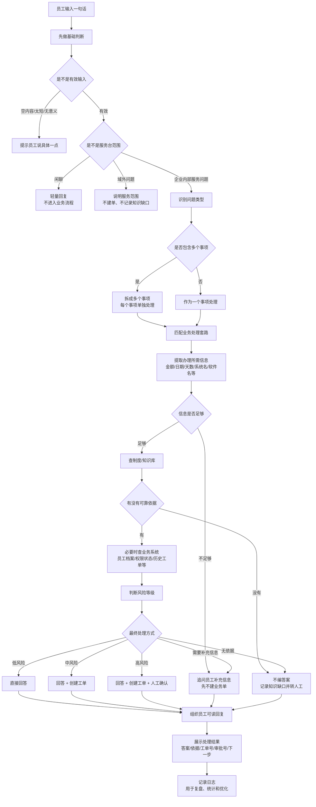
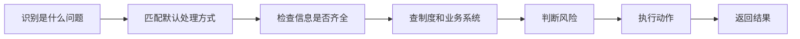
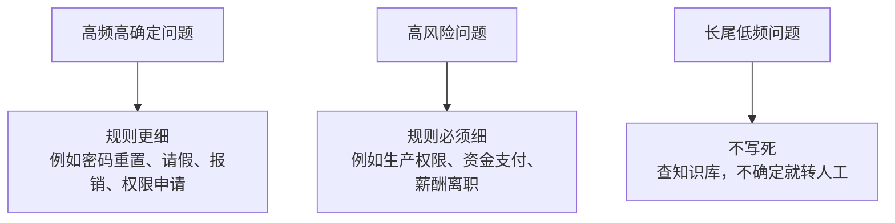
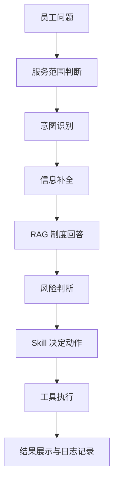

# Agent 决策处理流程

这张图描述的是 Agent 在企业服务台里的“可解释决策流程”：它不是模型脑子里的隐藏思考，而是产品和业务可以审计、可以配置、可以复盘的处理链路。

## 1. Agent 总体决策流程

## 2. 更简单的一句话版本

也可以理解成：

| 步骤 | 解决的问题 | 例子 |
| --- | --- | --- |
| 识别是什么问题 | 员工到底要问什么、办什么 | 是报销咨询，还是提交报销 |
| 匹配默认处理方式 | 这类问题通常怎么处理 | 制度咨询默认直接回答，办理事项默认建单 |
| 检查信息是否齐全 | 有没有缺少办理必需信息 | 报销缺金额，请假缺日期 |
| 查制度和业务系统 | 有没有依据，员工当前状态是什么 | 查报销制度、查年假余额、查权限状态 |
| 判断风险 | 这件事能不能自动处理 | 生产库权限、大额付款必须人工确认 |
| 执行动作 | 真正产生业务结果 | 回答、追问、建工单、建审批、转人工 |
| 返回结果 | 员工看到清楚的下一步 | 工单号、审批号、需要补充什么 |

## 3. 现实里是不是这么做

现实里的企业 Agent 通常会这么做，但不会把“每一种自然语言问法”都写死。

更合理的做法是分三层：

也就是说，现实里不是所有问题都要规定得很细，而是：

| 问题类型 | 是否需要细规则 | 原因 |
| --- | --- | --- |
| 高频问题 | 需要相对细 | 自动化收益高，员工经常问 |
| 高风险问题 | 必须细 | 不能让模型自由决定是否执行 |
| 有明确流程的问题 | 需要细 | 比如请假、报销、权限申请，缺字段会影响办理 |
| 低风险制度咨询 | 不必太细 | 查到制度后回答即可 |
| 长尾问题 | 不应该太细 | 写不完，维护成本高，适合知识库 + 转人工 |

## 4. 不建议把所有问题都规定得过细

如果把每一类问题都拆得非常细，会有几个问题：

| 问题 | 后果 |
| --- | --- |
| 维护成本高 | 每改一个制度或流程，都要改很多规则 |
| 覆盖永远不完整 | 员工说法太多，不可能全枚举 |
| 容易误判 | 规则太细后，相似问题可能被分错 |
| 产品变笨重 | Agent 像流程表单，不像自然语言助手 |
| 上线迭代慢 | 新增一个场景需要大量配置和测试 |

所以更推荐的产品策略是：

1. 先把大类分清楚：IT、HR、财务、行政。
2. 对高频事项做清晰流程：密码、请假、报销、权限、报修。
3. 对高风险事项做强规则：生产数据、资金支付、人事敏感。
4. 对长尾问题交给知识库，没依据就转人工。
5. 通过后台日志和知识缺口，持续发现哪些问题值得沉淀成新流程。

## 5. 适合这个项目的简化能力模型

当前项目可以收敛成下面这套产品表达：

其中：

| 能力 | 作用 |
| --- | --- |
| 服务范围判断 | 先拦住闲聊和域外问题 |
| 意图识别 | 判断员工问的是哪类业务 |
| 信息补全 | 缺关键信息时先追问 |
| RAG 制度回答 | 查知识库，给可追溯依据 |
| 风险判断 | 决定能不能自动处理 |
| Skill 决定动作 | 每类业务默认怎么办 |
| 工具执行 | 查员工、查权限、建工单、建审批、记录知识缺口 |
| 结果展示与日志 | 员工看结果，后台可复盘 |

一句话总结：

> 企业 Agent 不应该把所有问题都写死，但必须把“高频流程”和“高风险边界”规定清楚；其他长尾问题交给知识库和人工兜底。
