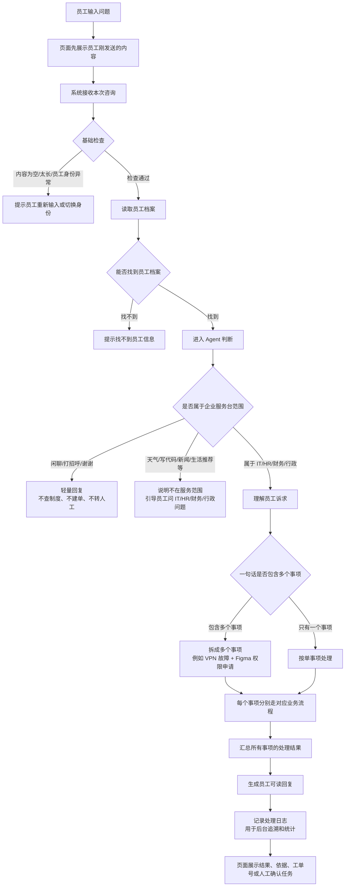
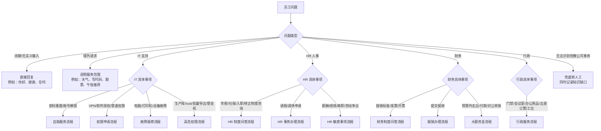
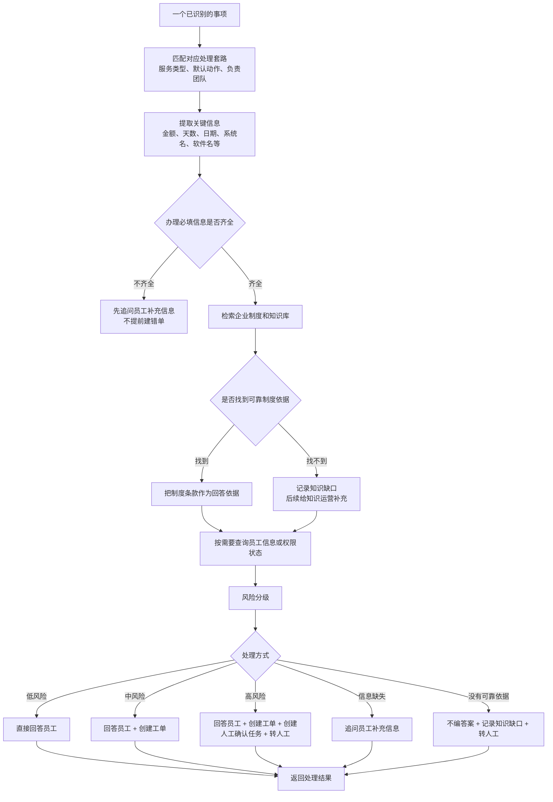
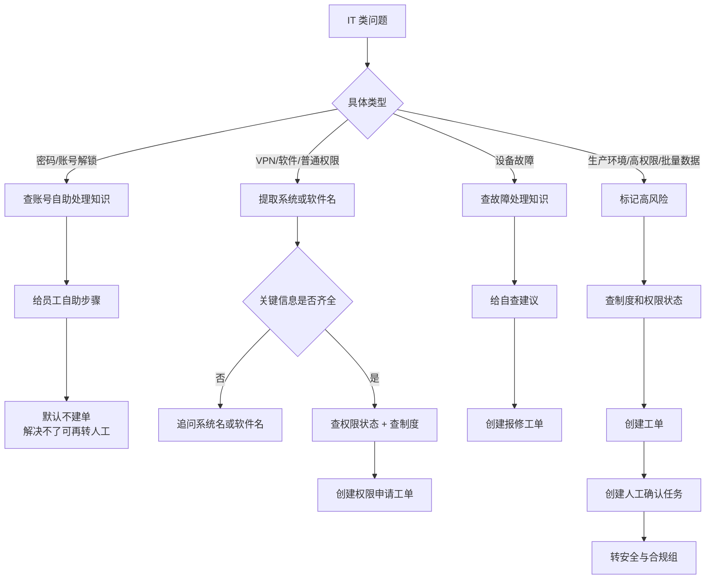
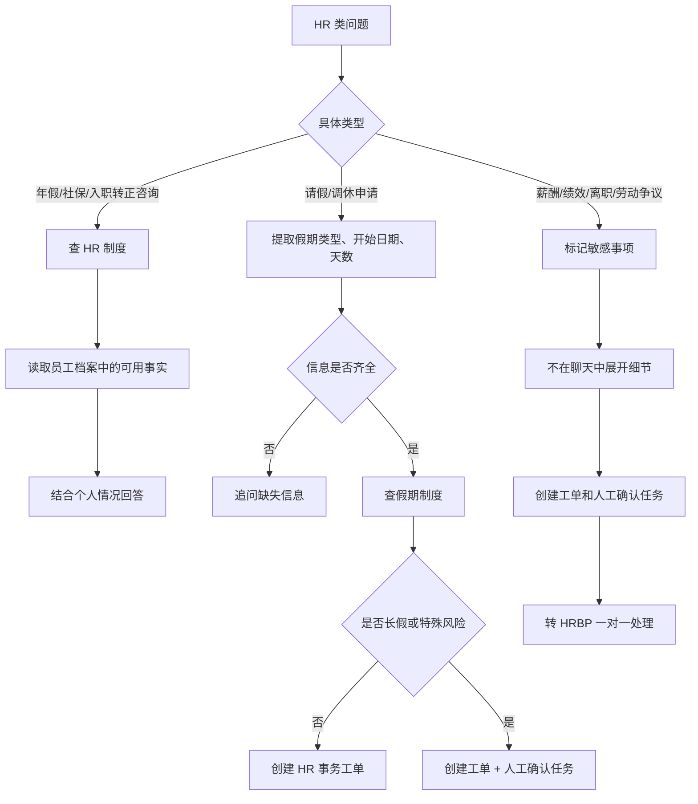
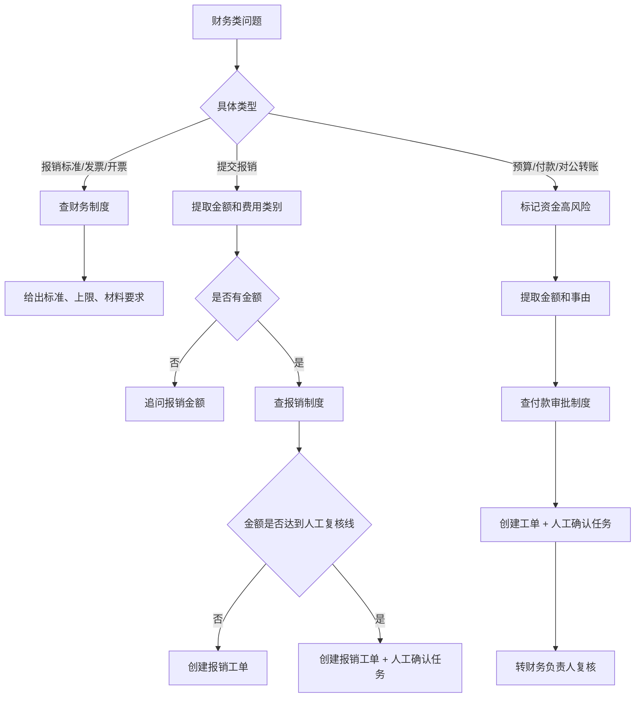
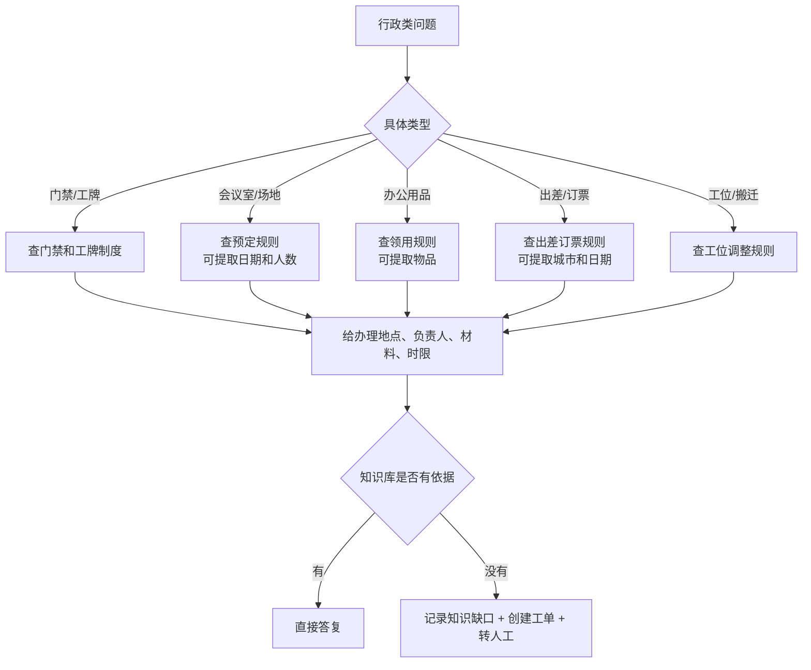
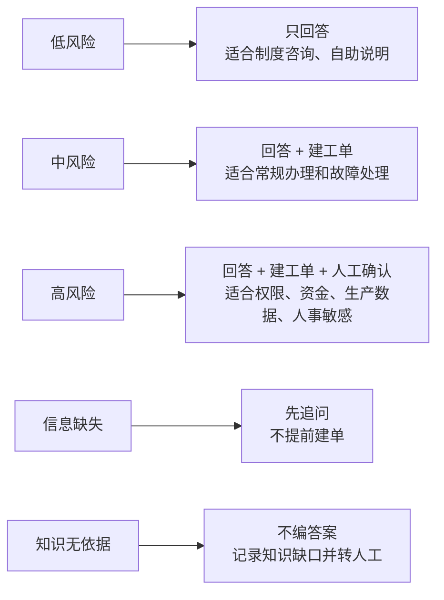
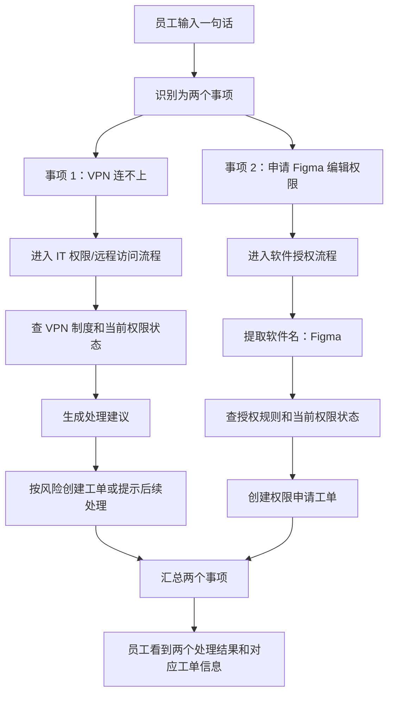

# Agent 业务处理流程图

这份文档说明员工在服务台输入问题后，Agent 如何判断问题类型、进入哪条业务流程、会执行哪些操作，以及什么情况下只回复、追问、建单或转人工。

## 1. 整体处理流程

说明：

- “页面先展示员工刚发送的内容”不是意图识别，只是聊天界面把员工的话显示出来。
- 真正的意图识别发生在“理解员工诉求”这一步。
- “基础检查”不是审批，只是检查输入是否能被系统正常处理。

## 2. 员工问题如何分流

## 3. 单个事项的标准处理流程

## 4. 具体问题进入什么流程

| 员工问题类型 | 典型说法 | 进入流程 | Agent 会做什么 | 员工会看到什么 |
| --- | --- | --- | --- | --- |
| 闲聊/打招呼 | “你好”“在吗”“谢谢” | 闲聊拦截 | 直接轻量回复，不查知识库，不建单 | 服务台能力说明或简单回应 |
| 域外请求 | “今天天气怎么样”“帮我写代码”“午饭吃什么” | 域外拦截 | 说明这不是企业服务台范围，不记录知识缺口 | 告诉员工可咨询 IT/HR/财务/行政事项 |
| 账号密码 | “OA 密码忘了”“邮箱登不上” | IT 自助服务 | 查 IT 知识库，必要时结合员工信息 | 给重置/解锁步骤，不默认建单 |
| VPN 或普通权限 | “帮我开通 VPN”“申请 Figma 编辑权限” | IT 权限申请 | 提取系统或软件名，查权限状态，查制度，创建权限申请工单 | 权限规则说明 + 工单号 + 预计响应时间 |
| 软件授权但缺软件名 | “帮我申请一个软件授权” | 信息补全 | 发现缺少“软件名称” | 追问员工要申请哪个软件 |
| 设备故障 | “电脑蓝屏”“打印机坏了”“笔记本开不了机” | IT 故障报修 | 查故障处理知识，创建报修工单 | 自查建议 + 报修工单号 |
| 生产数据/高权限 | “开生产库权限”“给我 root”“导出全部客户名单” | 高危权限 | 查制度和现有权限，创建工单，创建人工确认任务，转安全与合规组 | 明确说明不能直接开通 + 人工确认编号 |
| 年假/社保/转正咨询 | “年假还剩几天”“社保怎么转”“转正流程是什么” | HR 制度问答 | 查 HR 制度，读取员工档案中可用事实 | 结合员工档案和制度依据回答 |
| 请假/调休申请 | “帮我请 3 天年假，从下周一开始” | HR 事务办理 | 提取假期类型、开始日期、天数；查制度；创建事务工单 | 已受理说明 + 工单号 + 审批人 |
| 请假信息不全 | “我想请假” | 信息补全 | 发现缺少假期类型、开始日期、天数 | 追问员工补齐关键信息 |
| 长假申请 | “我要请 12 天年假” | 高风险 HR 事务 | 因连续请假天数较长，升级人工确认 | 工单 + 人工确认，提示需上级和 HR 确认 |
| 薪酬/绩效/离职 | “我想调薪”“为什么工资少了”“我要离职” | HR 敏感事项 | 不在聊天里展开细节，创建人工确认任务，转 HRBP | 告知 HRBP 会一对一跟进 |
| 报销标准 | “成都住宿能报多少”“打车费能报吗” | 财务制度问答 | 查财务制度，引用金额标准和适用条件 | 报销规则 + 制度依据 |
| 提交报销 | “帮我报销 1200 元差旅费” | 报销办理 | 提取金额和费用类别，查制度，创建报销工单 | 报销工单号 + 后续贴票/交单提醒 |
| 报销缺金额 | “帮我提交一笔报销” | 信息补全 | 发现缺少报销金额 | 追问员工补充金额 |
| 大额报销 | “帮我报销 8600 元” | 高风险财务办理 | 因金额超过自动通道上限，创建工单和人工确认任务 | 告知需财务复核，不直接自动通过 |
| 预算/付款 | “有一笔 8 万预算外付款要审批” | 大额资金流程 | 提取金额，查制度，创建工单和人工确认任务，转财务负责人 | 明确不会自动提交资金动作 + 人工确认编号 |
| 发票/开票 | “公司开票信息是什么”“专票怎么开” | 财务制度问答 | 查发票制度或开票信息 | 给开票要求、抬头/税号相关说明 |
| 行政服务 | “会议室怎么订”“工牌丢了”“想领打印纸”“下周出差怎么订票” | 行政服务 | 查行政制度，说明地点、负责人、时限、材料要求 | 给办理路径和注意事项 |
| 公司事务但无法匹配 | “带样机去德国参展的清关手续怎么办” | 兜底转人工 | 查不到可靠制度时记录知识缺口，创建工单，转服务台值班 | 不编答案，给工单号，说明人工跟进 |

## 5. 四类业务流程展开

### IT 流程

### HR 流程

### 财务流程

### 行政流程

## 6. 风险等级决定会不会自动办理

当前风险升级规则的业务含义：

| 触发情况 | 处理结果 |
| --- | --- |
| 出现生产环境、生产库、root、管理员权限、堡垒机等词 | 直接按高风险处理 |
| 出现批量导出、全量数据、客户名单等词 | 直接按高风险处理 |
| 薪酬、绩效、离职、裁员、劳动争议 | 转 HRBP 或相关人工团队 |
| 报销金额达到 5000 元及以上 | 升级为财务人工复核 |
| 单笔金额达到 50000 元及以上 | 触发大额兜底，高风险 |
| 连续请假达到 10 天及以上 | 需要上级和 HR 双重确认 |
| 试用期员工申请权限 | 风险等级上调一级 |
| 知识库没有可靠依据 | 不自动答复，至少转人工 |
| 关键信息缺失 | 强制追问，不先建单 |

## 7. 一个完整例子

员工输入：

> VPN 连不上，顺便帮我申请 Figma 编辑权限。

处理过程：

最终员工看到的不是一段泛泛回答，而是分事项的结果：

- VPN 相关处理依据是什么。
- Figma 权限是否已提交申请。
- 哪些事项已经生成工单。
- 如果风险较高，哪些事项需要人工确认。

## 8. 这套设计的产品价值

| 设计点 | 解决的问题 |
| --- | --- |
| 先判断服务范围 | 避免天气、写代码、午饭推荐这类问题污染工单和知识缺口 |
| 多事项拆分 | 员工一句话可以同时问多个事，不需要拆开重问 |
| 必填信息追问 | 缺金额、缺日期、缺软件名时不乱建单 |
| 制度依据优先 | 员工得到的不是“模型猜测”，而是可追溯的制度答案 |
| 风险分级 | 低风险自动答，高风险不自动执行 |
| 人工确认任务 | 高风险事项给人工准备好证据、员工信息、制度依据和建议动作 |
| 知识缺口沉淀 | 答不上来的问题不会消失，会进入后台知识运营 |
