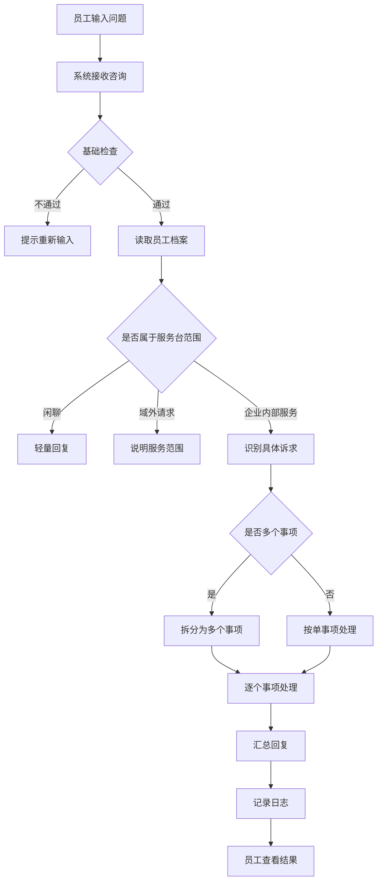
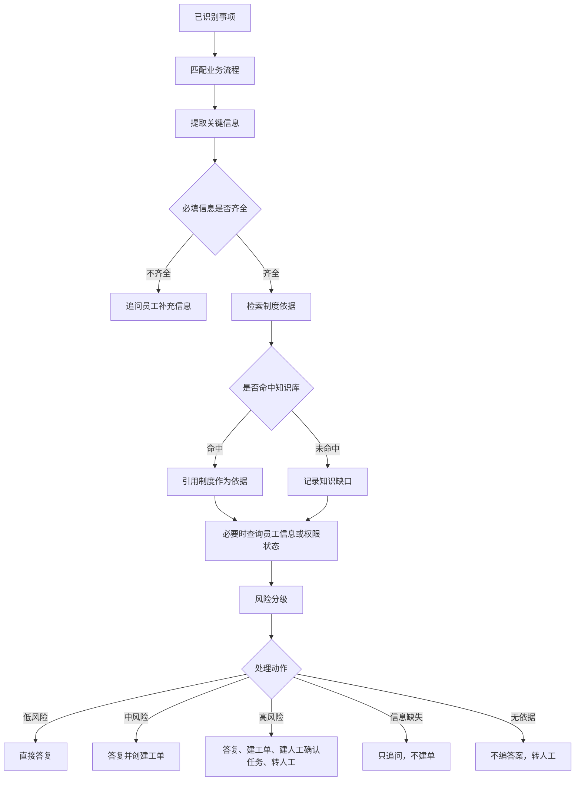

# 企业内部服务台 Agent PRD

## 1. 文档信息

| 项目 | 内容 |
| --- | --- |
| 产品名称 | 企业内部服务台 Agent |
| 文档类型 | PRD |
| 当前版本 | v1.0 |
| 适用范围 | 员工端智能服务台、服务台后台处理与知识运营 |
| 覆盖业务 | IT、HR、财务、行政 |

## 2. 产品背景

企业内部服务台每天会收到大量重复咨询和事务办理请求，例如密码重置、年假余额、报销标准、会议室预定、设备报修等。

传统服务台存在三个典型问题：

| 问题 | 影响 |
| --- | --- |
| 重复咨询占用人工 | 服务台同事被低价值问题消耗，响应效率低 |
| 员工不知道找谁 | IT、HR、财务、行政入口分散，员工需要反复确认流程 |
| 风险事项难以自动化 | 权限、资金、人事敏感事项不能简单交给机器人自动执行 |

本产品希望通过一个企业服务台 Agent，让员工用自然语言描述问题，系统自动判断诉求类型、检索制度依据、评估风险，并决定是直接答复、创建工单、追问信息，还是转人工确认。

## 3. 产品目标

1. 降低员工获取内部服务的门槛，员工不用先判断该找哪个部门。
2. 对低风险制度咨询提供即时答复，并给出制度依据。
3. 对常规办理事项自动创建工单，减少人工分拣。
4. 对高风险事项只做材料整理和人工确认，不直接执行敏感操作。
5. 对知识库没有覆盖的问题沉淀为知识缺口，帮助后续运营补充。

## 4. 用户角色

| 角色 | 使用场景 | 关注点 |
| --- | --- | --- |
| 普通员工 | 在员工端输入问题或办理诉求 | 快速知道答案、工单是否提交、接下来要做什么 |
| 服务台处理人员 | 在后台查看工单和处理任务 | 问题分类准确、信息完整、处理依据清楚 |
| 审批/确认人员 | 处理高风险人工确认任务 | 风险原因、员工信息、制度依据、建议动作是否完整 |
| 知识运营人员 | 查看知识缺口并补充制度内容 | 哪些问题答不上来、出现频次、归属领域 |
| 管理者 | 查看服务台效果看板 | 自动解决率、转人工率、知识命中率、响应效率 |

## 5. 产品范围

### 5.1 本期范围

| 模块 | 说明 |
| --- | --- |
| 员工端聊天入口 | 员工输入自然语言问题，查看 Agent 回复和处理结果 |
| 多事项识别 | 一句话中包含多个诉求时，拆分后分别处理 |
| 服务范围判断 | 区分企业服务问题、闲聊和域外请求 |
| 知识库检索 | 从 IT、HR、财务、行政知识库检索制度依据 |
| 关键信息提取 | 提取金额、日期、天数、系统名、软件名、人数等办理信息 |
| 风险分级 | 按低、中、高风险决定自动答复、建单或人工确认 |
| 工单创建 | 对需要落地处理的事项自动生成工单 |
| 人工确认任务 | 对高风险事项创建人工确认任务 |
| 知识缺口记录 | 知识库无依据时记录缺口并转人工 |
| 处理过程展示 | 员工侧可查看依据、风险和处理动作 |
| 服务台后台 | 查看工单、人工确认、知识缺口和效果指标 |

### 5.2 暂不包含

| 不包含内容 | 说明 |
| --- | --- |
| 真实企业系统写入 | 当前为模拟工单、审批、员工档案和权限系统 |
| 自动执行高风险操作 | 生产库权限、资金支付、人事敏感事项必须人工确认 |
| 通用问答能力 | 天气、新闻、写代码、生活推荐等不属于服务台范围 |
| 跨公司事务 | 只处理本公司内部事务 |

## 6. 核心业务流程

### 6.1 总流程

### 6.2 单事项处理流程

## 7. 业务分流规则

| 员工问题类型 | 示例 | 进入流程 | 系统操作 | 输出结果 |
| --- | --- | --- | --- | --- |
| 闲聊 | “你好”“谢谢”“在吗” | 闲聊拦截 | 直接回复，不检索、不建单 | 简短回应或能力说明 |
| 域外请求 | “今天天气怎么样”“帮我写代码” | 域外拦截 | 说明不在服务范围 | 引导咨询 IT/HR/财务/行政 |
| 账号密码 | “OA 密码忘了” | IT 自助服务 | 查账号知识库 | 返回重置步骤 |
| VPN/软件权限 | “申请 Figma 编辑权限” | IT 权限申请 | 提取软件名，查权限状态，查制度，建工单 | 工单号、响应时间、处理说明 |
| 设备故障 | “笔记本蓝屏了” | IT 故障报修 | 查故障知识，建报修工单 | 自查建议、工单号 |
| 生产数据/高权限 | “开生产库权限” | 高危权限 | 查制度，建工单，建人工确认任务 | 明确不能直接开通，等待人工确认 |
| 年假/社保/转正 | “年假还剩几天” | HR 制度问答 | 查制度，读员工档案 | 结合个人情况回答 |
| 请假/调休 | “帮我请 3 天年假” | HR 事务办理 | 提取假期类型、日期、天数，建工单 | 工单号、审批人 |
| 薪酬/绩效/离职 | “我想调薪”“我要离职” | HR 敏感事项 | 不展开细节，转 HRBP | 人工确认任务 |
| 报销标准 | “成都住宿能报多少” | 财务制度问答 | 查财务制度 | 报销标准和制度依据 |
| 提交报销 | “帮我报销 1200 元差旅费” | 报销办理 | 提取金额，查制度，建工单 | 报销工单和材料提醒 |
| 大额报销 | “报销 8600 元” | 高风险财务办理 | 建工单，建人工确认任务 | 财务人工复核 |
| 预算/付款 | “8 万预算外付款” | 大额资金流程 | 查审批制度，转财务负责人 | 人工确认任务 |
| 发票/开票 | “公司开票信息是什么” | 财务制度问答 | 查开票规则 | 开票要求和信息 |
| 行政事项 | “会议室怎么订”“工牌丢了” | 行政服务 | 查行政制度 | 办理路径、负责人、时限 |
| 无法识别的公司事务 | “德国参展清关手续怎么办” | 兜底转人工 | 查无依据后记录知识缺口，建工单 | 不编答案，人工跟进 |

## 8. 功能需求

### 8.1 员工端咨询

| 编号 | 需求 | 优先级 |
| --- | --- | --- |
| FR-001 | 员工可以在聊天框输入自然语言问题或办理诉求 | P0 |
| FR-002 | 员工发送后，页面应展示员工刚发送的内容 | P0 |
| FR-003 | 系统应返回 Agent 的处理结果，包括答复正文和必要的工单/审批信息 | P0 |
| FR-004 | 员工可查看“依据与处理过程”，了解制度来源、风险判断和处理动作 | P1 |
| FR-005 | 当本轮产生工单或审批时，员工门户概览应同步更新 | P1 |

### 8.2 服务范围判断

| 编号 | 需求 | 优先级 |
| --- | --- | --- |
| FR-006 | 系统应识别闲聊、感谢、告别、无实义输入，并直接轻量回复 | P0 |
| FR-007 | 系统应识别天气、写代码、新闻、市场行情、生活推荐等域外请求 | P0 |
| FR-008 | 域外请求不得创建工单、不得记录知识缺口、不得转人工 | P0 |

### 8.3 意图识别与多事项拆分

| 编号 | 需求 | 优先级 |
| --- | --- | --- |
| FR-009 | 系统应识别 IT、HR、财务、行政四类服务诉求 | P0 |
| FR-010 | 系统应支持一句话多个事项的拆分，例如“VPN 连不上，顺便申请 Figma 权限” | P0 |
| FR-011 | 每个事项应独立完成知识检索、风险分级、工具调用和回复生成 | P0 |
| FR-012 | 无法识别但像公司事务的问题，应进入兜底转人工流程 | P0 |

### 8.4 关键信息提取与追问

| 编号 | 需求 | 优先级 |
| --- | --- | --- |
| FR-013 | 系统应从员工输入中提取金额、日期、天数、系统名、软件名、人数等信息 | P0 |
| FR-014 | 软件授权缺少软件名时，应追问员工补充软件名称 | P0 |
| FR-015 | 请假申请缺少假期类型、开始日期或天数时，应追问补充信息 | P0 |
| FR-016 | 报销或付款缺少金额时，应追问补充金额 | P0 |
| FR-017 | 信息缺失时不得提前创建业务工单，避免产生错误工单 | P0 |

### 8.5 知识检索与依据展示

| 编号 | 需求 | 优先级 |
| --- | --- | --- |
| FR-018 | 系统应按问题所属领域检索对应知识库 | P0 |
| FR-019 | 命中制度后，回复应展示可追溯的制度依据 | P0 |
| FR-020 | 知识库未命中时，系统不得凭常识编造答案 | P0 |
| FR-021 | 知识库未命中时，应记录知识缺口并转人工处理 | P0 |

### 8.6 风险分级

| 编号 | 需求 | 优先级 |
| --- | --- | --- |
| FR-022 | 系统应将每个事项分为低风险、中风险或高风险 | P0 |
| FR-023 | 低风险事项应直接答复，不默认建单 | P0 |
| FR-024 | 中风险事项应答复并创建工单 | P0 |
| FR-025 | 高风险事项应创建工单和人工确认任务，不直接执行敏感操作 | P0 |
| FR-026 | 系统应保留风险命中原因，便于后台追溯 | P1 |

### 8.7 工单与人工确认

| 编号 | 需求 | 优先级 |
| --- | --- | --- |
| FR-027 | 常规办理类事项应自动创建工单，并路由到对应团队 | P0 |
| FR-028 | 高风险事项应创建人工确认任务 | P0 |
| FR-029 | 人工确认任务应包含员工信息、制度依据、风险原因和建议动作 | P0 |
| FR-030 | 员工端应展示工单号或人工确认编号 | P0 |

### 8.8 日志与后台追溯

| 编号 | 需求 | 优先级 |
| --- | --- | --- |
| FR-031 | 每次 Agent 处理应记录处理日志 | P0 |
| FR-032 | 日志应包含问题、识别结果、知识命中、风险等级、工具调用、处理动作和耗时 | P1 |
| FR-033 | 后台应支持查看工单、人工确认任务、知识缺口和服务指标 | P1 |

## 9. 风险规则

| 触发条件 | 风险处理 |
| --- | --- |
| 生产环境、生产库、线上库、root、sudo、超级管理员、堡垒机等关键词 | 高风险，必须人工确认 |
| 批量导出、全量导出、客户名单、全量数据等关键词 | 高风险，必须人工确认 |
| 薪酬、绩效、离职、裁员、劳动争议 | 高风险，转 HRBP 或相关人工团队 |
| 报销金额达到 5000 元及以上 | 升级为财务人工复核 |
| 单笔金额达到 50000 元及以上 | 大额兜底，高风险 |
| 连续请假达到 10 天及以上 | 需要上级和 HR 双重确认 |
| 试用期员工申请系统权限 | 风险等级上调一级 |
| 知识库没有可靠依据 | 至少中风险，不自动答复 |
| 必填信息缺失 | 强制追问，不创建业务工单 |

## 10. 页面与交互要求

### 10.1 员工端

| 区域 | 要求 |
| --- | --- |
| 输入区 | 支持自然语言输入问题或办理请求 |
| 回复区 | 展示 Agent 回复，多个事项应分块展示 |
| 结果卡片 | 展示事项标题、处理状态、工单号或审批号 |
| 依据与过程 | 默认折叠，展开后展示制度引用、风险等级、处理动作 |
| 错误提示 | 输入无效或员工信息异常时，给出可理解提示 |

### 10.2 后台

| 模块 | 要求 |
| --- | --- |
| 工单中心 | 展示 Agent 创建的工单及处理状态 |
| 人工审核台 | 展示高风险事项的确认任务 |
| 知识运营 | 展示知识缺口、出现次数、归属领域 |
| 效果看板 | 展示自动解决率、转人工率、知识命中率、响应时间等指标 |

## 11. 验收标准

| 场景 | 输入示例 | 预期结果 |
| --- | --- | --- |
| 闲聊 | “你好” | 直接回复服务台能力，不建单、不记录知识缺口 |
| 域外请求 | “今天天气怎么样” | 说明不在服务范围，不建单、不转人工 |
| 密码重置 | “OA 密码忘了” | 返回自助重置步骤，不默认建单 |
| 软件授权 | “申请 Figma 编辑权限” | 创建权限申请工单 |
| 缺软件名 | “申请一个软件授权” | 追问软件名称 |
| 设备报修 | “电脑蓝屏了” | 返回自查建议并创建报修工单 |
| 生产库权限 | “我要生产数据库权限” | 创建工单和人工确认任务，不直接开通 |
| 年假查询 | “年假还剩几天” | 结合员工档案和制度回答 |
| 请假申请完整 | “帮我请 3 天年假，从下周一开始” | 创建 HR 事务工单 |
| 请假申请不完整 | “我想请假” | 追问假期类型、开始日期、天数 |
| 长假申请 | “我要请 12 天年假” | 升级人工确认 |
| 薪酬问题 | “我想申请调薪” | 转 HRBP，不在聊天中展开细节 |
| 报销标准 | “成都住宿能报多少” | 返回制度标准和依据 |
| 报销办理 | “帮我报销 1200 元差旅费” | 创建报销工单 |
| 大额报销 | “帮我报销 8600 元” | 创建工单和人工确认任务 |
| 无知识依据 | “带样机去德国参展的清关手续怎么办” | 不编答案，记录知识缺口并转人工 |
| 多事项 | “VPN 连不上，顺便申请 Figma 编辑权限” | 拆成两个事项分别处理 |

## 12. 数据与指标

| 指标 | 含义 |
| --- | --- |
| 咨询总量 | 员工提交的有效服务请求数量 |
| 自动答复量 | 低风险且已直接答复的请求数量 |
| 工单创建量 | Agent 自动创建的工单数量 |
| 人工确认量 | 高风险事项生成的人工确认任务数量 |
| 知识命中率 | 能从知识库找到可靠依据的请求占比 |
| 知识缺口量 | 未命中知识库并被记录的问题数量 |
| 转人工率 | 需要人工处理的请求占比 |
| 平均响应时间 | 员工提交后收到 Agent 回复的平均耗时 |

## 13. 边界与异常

| 场景 | 处理方式 |
| --- | --- |
| 输入为空或只有标点 | 提示员工补充具体诉求 |
| 员工档案不存在 | 提示找不到员工信息 |
| 问题不属于企业服务台范围 | 说明服务范围，不进入业务流程 |
| 意图识别不确定 | 走兜底转人工，避免误执行 |
| 知识库无依据 | 不编造答案，记录知识缺口 |
| 必填信息缺失 | 追问，不建业务工单 |
| 高风险事项 | 不自动执行，只创建人工确认任务 |
| 多事项中部分高风险 | 每个事项独立处理，高风险部分单独转人工 |

## 14. 后续迭代方向

| 方向 | 说明 |
| --- | --- |
| 接入真实企业系统 | 将当前模拟工单、审批、员工档案、权限系统替换为真实系统对接 |
| 增强多轮补全 | 员工补充信息后，自动延续上一轮未完成事项 |
| 知识库运营闭环 | 知识缺口补充后，自动关联历史问题并提升命中率 |
| 审批策略配置化 | 让业务管理员配置不同金额、权限、部门的审批规则 |
| 员工个性化回答 | 结合员工所在地、职级、部门、在职状态给更精准答复 |
| 效果评估体系 | 对自动解决率、误转人工、错误建单、知识缺口闭环周期做长期跟踪 |
